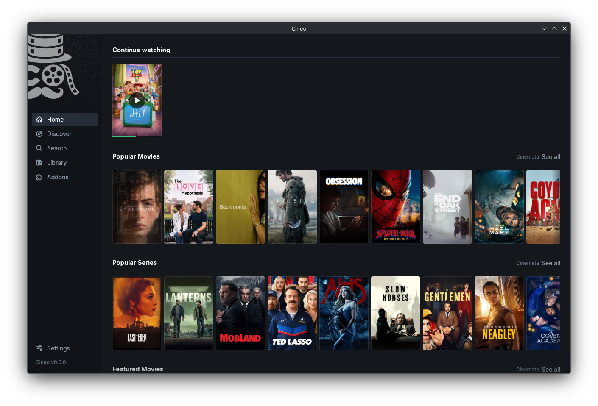

# Cineo

A fast, native desktop media center written in Rust. It works with
Stremio-protocol addons.



> **Pre-alpha.** It works, but there are no installers yet.
> See [what works](docs/COMPATIBILITY.md).

## Features

- Install addons by URL
- Browse catalogs, search and view details
- Play streams in the app window, including torrents
- Continue watching and a local library
- No account and no cloud: your data stays on your machine

Runs on Linux, Windows and macOS.

## Run it

You need Rust and libmpv.

```sh
git clone https://github.com/mdmrk/cineo && cd cineo
cargo run -p cineo-desktop --release
```

A [command-line tool](docs/DEVELOPMENT.md#command-line-tool) is also
included, mainly for debugging addons.

## Learn more

- [Roadmap](docs/ROADMAP.md)
- [Architecture](docs/ARCHITECTURE.md)
- [Development](docs/DEVELOPMENT.md)
- [Security](docs/SECURITY.md)

## License

[MIT](LICENSE). Cineo is not affiliated with Stremio. It ships no content
and no content addons. See [Legal](docs/LEGAL.md).
