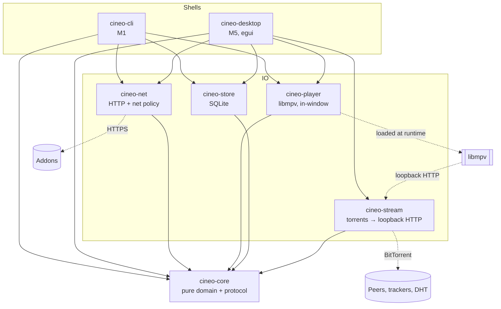
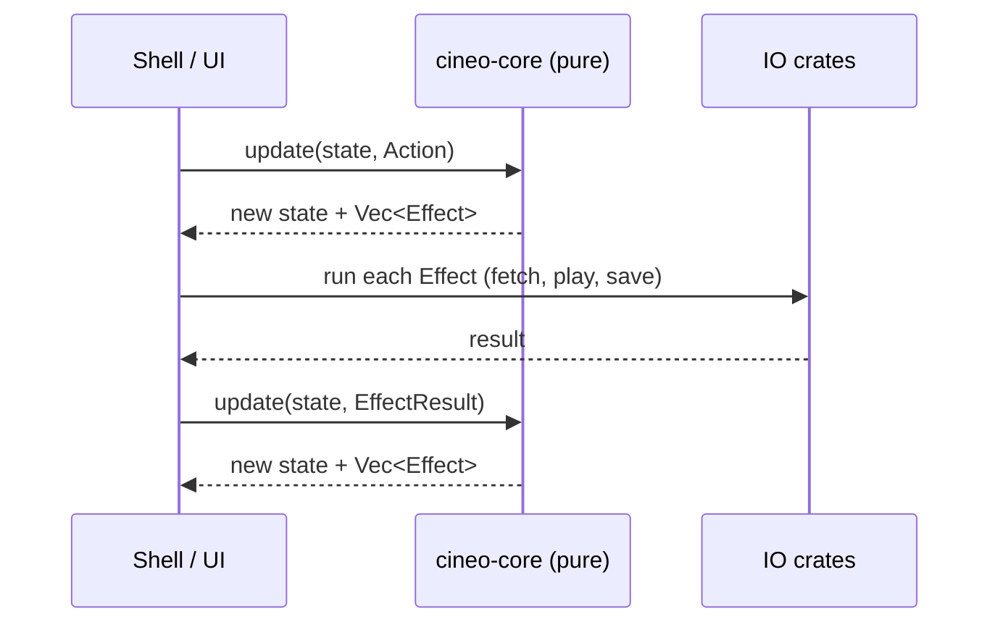

# Architecture

Status: **partly implemented** (M1–M5, see [ROADMAP.md](ROADMAP.md)).
Decisions are recorded in [DECISIONS.md](DECISIONS.md) and [ADR/](ADR/). This
document describes the target; each section says what exists today.

## System overview

Cineo follows a **functional core, imperative shell** design (ADR-0001):

- **`cineo-core`** is pure. It holds domain types, addon-protocol parsing and
  validation, request planning, and state reducers. It does no IO, has no
  async and no clock, so it can be tested exhaustively and quickly.
- **IO crates** perform effects described by the core. These are HTTP, the
  the player (libmpv) and storage, and each has its own safety policy.
- **Shells** wire everything together and present state. The CLI comes first;
  the desktop GUI follows.

Today `cineo-core`, `cineo-net`, `cineo-cli`, `cineo-player`,
`cineo-store`, `cineo-desktop` and `cineo-stream` exist. The other crates are created by the milestone that
needs them ([ROADMAP.md](ROADMAP.md)).

## Dependency direction

`shells → IO crates → core`. Never the reverse.

- `cineo-core` depends on no other workspace crate, no async runtime, no
  HTTP or UI library.
- IO crates depend on `cineo-core` and their own libraries (reqwest, rusqlite).
  They do not depend on each other.
- Only shells depend on several IO crates and decide policy, for example
  whether private networks are allowed.

## Crate boundaries (ADR-0002)

| Crate | Responsibility | Created in |
|-------|---------------|-----------|
| `cineo-core` | Protocol model (wire → domain), validation, filtering, URL building, aggregation, library/progress model, reducers | M0 (placeholder) |
| `cineo-net` | `AddonClient`: fetch with timeouts, size caps, SSRF-safe resolver and redirect policy; later caching | M1 |
| `cineo-cli` | Headless shell; first end-to-end slice; debugging tool | M1 |
| `cineo-player` | Load libmpv at runtime, draw video into the window; typed commands, status and events | M3 (embedded since ADR-0014) |
| `cineo-store` | Persistence (installed addons, library, progress) with migrations | M4 |
| `cineo-desktop` | GUI shell: eframe/egui, custom theme, images via `cineo-net` | M5 |
| `cineo-stream` | Local streaming engine: torrent/archive/NZB sources → loopback HTTP URL (ADR-0010) | M9 |

**When to add a crate:** only when the new code has a different dependency
set or a different IO boundary from an existing crate. A new *concept* is a
module, not a crate. The addon protocol stays a module of `cineo-core` until a
second consumer needs it standalone (for example an addon SDK).

## Boundaries

### Addon boundary

Addon data is untrusted. It is parsed in two steps (ADR-0003):

1. **Wire level, lenient.** JSON is walked field by field. A bad optional
   field becomes "absent" and produces a `Warning`. A bad array element is
   skipped with a `Warning`. Only missing required invariants (for example
   the manifest `id` or `version`) are errors.
2. **Domain level, strict.** The domain types (`Manifest`, `Resource`,
   `CatalogDef`, `MetaPreview`, …) carry invariants such as non-empty ids,
   `http(s)`-only image URLs and resolved inheritance. Code past the parser
   never re-validates.

Warnings are returned next to the value (`Parsed<T>`), and shells log them.
This keeps "the addon sent garbage" observable without failing the whole
response.

### Networking boundary

All HTTP goes through `cineo-net`'s `AddonClient`, which enforces `NetPolicy`
([SECURITY.md](SECURITY.md)). The core only builds `Url`s; it never fetches.

### Player boundary (ADR-0014)

The core's `Effect::Play(PlayRequest)` starts playback. `cineo-player`
(`embedded::Player`) loads libmpv at runtime, and libmpv draws into the
desktop window through the OpenGL render API. The desktop shell draws the
video in an egui paint callback over the whole window and its own controls
on top (`cineo-desktop/src/player.rs`). The controls send typed
`PlayerCommand`s; a `Status` snapshot (position, pause, volume, tracks)
feeds them. Without libmpv, playback fails with a message saying so.

mpv's events become `PlayerEvent`s (`Progress`, `Ended`, `Failed`,
`Closed`) through a small state machine (`tracker`), which the shell turns
into core actions. Shells never send raw mpv commands or options.
Untrusted strings never become mpv options.

### Persistence boundary

`cineo-store` stores domain values (installed addons with their order,
library items, progress). The core defines what is stored: the
`SaveAddons`, `SaveLibraryItem` and `DeleteLibraryItem` effects, which
`Store::apply` executes. The store defines how: one SQLite file, the schema
version in `PRAGMA user_version`, append-only migrations run in one
transaction, and a fixture per released schema (`tests/fixtures/store/`).
The API is blocking; async shells call it off the runtime's worker threads.
Implemented in M4.
Secrets (future account tokens) go to the OS keyring, never to SQLite.

### UI boundary (ADR-0011)

The UI renders **state snapshots** and sends **actions**. It holds no business
logic. That keeps the GUI technology replaceable and lets the CLI exercise
exactly the same core paths.

Implemented in M5 (`cineo-desktop`):
- `view::show(ui, &State, &mut ViewState) -> Vec<Action>` is pure rendering.
  `ViewState` holds presentation only (open page, text being typed). The UI
  tests drive this function headlessly with `egui_kittest`.
- `app::CineoApp` is the shell. Before each frame it drains a channel of IO
  results and dispatches them. Fetches and playback run on a tokio runtime.
  Store writes go, in order, to one thread, which is joined on exit so the
  last progress write lands. mpv events become `PlaybackProgress` actions.
- Images: `images::NetImageLoader` (an egui `ImageLoader`) fetches through
  `cineo-net`, then decodes and downscales on the tokio blocking pool.

### Platform abstraction

Platform differences (paths, libmpv library names, keyring, URL scheme
registration) live in IO crates and shells behind small functions or traits.
They are introduced only when a second platform actually differs.

## State model and data flow

The state model follows the stremio-core idea of unidirectional flow, but
simplified (ADR-0001):

- `Effect` is a plain **enum (data)**, for example
  `FetchCatalog{addon, path}`, `Persist(LibraryItem)` or
  `Player(PlayerCommand)`. Effects are not boxed futures, so reducers can be
  tested by asserting on returned effects.
- Request identity: each fetch effect carries the `ResourcePath`, and late
  responses for stale requests are dropped by comparing it.
- Implemented in `cineo_core::app`: `update(&mut State, Action) -> Vec<Effect>`.
  IO results come back as `*Loaded` actions keyed by `(addon, path)`.
  Detail meta falls back through candidate addons in user order. Stream
  groups fail independently.

## Async and concurrency model

- `cineo-core` is synchronous.
- IO crates and shells use **tokio** (multi-threaded runtime) with `Send`
  futures. WASM is not a target, so stremio-core's `ConditionalSend` split
  is not needed.
- Addon requests for one aggregation run concurrently, each with its own
  timeout. One addon failing or timing out never blocks the others: results
  arrive as partial updates.
- The player has one thread blocked in `mpv_wait_event`. It updates the
  `Status` snapshot and sends `PlayerEvent`s on a channel.

## Error model

- Libraries use `thiserror` enums with `#[non_exhaustive]`, one per failure
  domain (`ManifestError`, `FetchError`, …). Messages say what failed and
  where.
- Binaries (shells) use `anyhow` with `.context(...)` at each layer boundary.
- **Errors and logs never contain full addon URLs.** Addon paths often embed
  user configuration or API keys, so only the origin and the resource path
  are logged.
- Partial failure is normal. Aggregations return per-addon results, never one
  combined error.

## Observability

`tracing` spans exist per addon request (`req` id, addon origin, resource
path), per playback session and per startup phase. See
[DEBUGGING.md](DEBUGGING.md).

## Testing boundaries

See [TESTING.md](TESTING.md):

- The core is tested with fixtures and pure assertions.
- IO crates are tested against local mocks (HTTP mock server, fake mpv
  socket, temporary SQLite).
- Shells get end-to-end smoke tests.

## Future extension points

- **Transports.** The `TransportUrl` type could gain a variant if another
  transport is ever accepted. That is currently rejected (ADR-0007).
- **Embedded player.** A second implementation of the player boundary using
  the libmpv render API.
- **Sync.** Not planned for now (owner decision 2026-10-06). If that
  changes, it would be a crate behind the persistence boundary, with a new
  ADR.
- **Stream sources.** The "stream resolver" turns non-URL sources into
  playable URLs: `cineo-stream`, M9/M10 (ADR-0010).
- **Deep links.** `stremio://` and `cineo://` URLs parse into typed routes
  in the core (pure). Shells register the schemes per platform.
