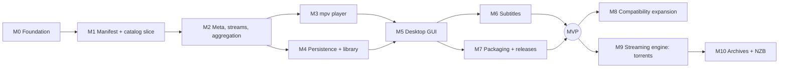

# Roadmap

Milestones are ordered by dependency. Each one ends with something runnable
and tested. Update the **Status** column when a milestone's acceptance
criteria are met, not before.

| Milestone | Status |
|-----------|--------|
| M0 Engineering foundation | **Done** (2026-10-06) |
| M1 Manifest + catalog vertical slice | **Done** (2026-10-06) |
| M2 | Next |
| M3 – M10 | Planned |

---

### M0 — Engineering foundation
- **Goal:** a repository where correct work is the easy path.
- **Deliverables:**
  - Workspace with a pinned toolchain and lint policy.
  - CI (fmt, clippy, tests on 3 OSes, docs, deny, zizmor), release
    workflow skeleton, Dependabot.
  - Docs: goals, architecture, protocol, security, testing, debugging, ADRs.
  - Agent instructions, rules and skills.
- **Acceptance:** `scripts/check.sh` passes; CI is green on the first push.

### M1 — Manifest + catalog vertical slice
- **Prerequisites:** M0.
- **Deliverables:**
  - `cineo-core::addon`: `TransportUrl`, `Manifest` (lenient parse +
    warnings), `ResourcePath` URL building, `Manifest::supports`,
    `CatalogDef::check_extra`, catalog response parsing.
  - `cineo-net`: `AddonClient` + `NetPolicy`.
  - `cineo-cli`: `cineo addon inspect <url>` and
    `cineo catalog <url> <type> <id> [--extra k=v]`.
  - Fixtures: `basic/`, `quirks/`, `invalid/`.
- **Tests:**
  - Fixture tests for every rule in ADDON_PROTOCOL.md §Manifest/§Requests.
  - IP classification tables.
  - Mock-server tests: loopback blocked by default, redirect loop, size cap,
    gzip bomb, timeout, no URL leakage.
  - CLI E2E against a mock addon.
- **Acceptance:**
  - All of the above pass in CI on 3 OSes.
  - A manual live check against a public addon (for example Cinemeta) is
    recorded in COMPATIBILITY.md → Verified addons.
  - The M1 rows in COMPATIBILITY.md move to Supported or Verified.

### M2 — Meta, streams, aggregation
- **Prerequisites:** M1.
- **Deliverables:**
  - `Meta`, `Video` and `Stream` models (all sources parsed; only `http(s)`
    marked playable).
  - The reducer/effect structure (ADR-0001) for aggregation: request
    planning across addons, concurrent fetch, partial results, stale-response
    dropping.
  - CLI `cineo meta`, `cineo streams`, `cineo search`. Addons are passed as
    repeated `--addon` arguments; there is no persistence yet.
- **Tests:** reducer tests (effects, partial failure, ordering), stream-source
  fixtures, mock-server aggregation E2E.
- **Acceptance:** the CLI lists streams from two mock addons, with one failing
  addon shown as failed and not hiding the other.

### M3 — mpv player (external process)
- **Prerequisites:** M2.
- **Deliverables:**
  - `PlayerCommand` / `PlayerEvent` in the core.
  - `cineo-player-mpv`: spawn with safe options, IPC socket, typed commands,
    event stream.
  - `cineo play`.
- **Tests:** a fake IPC peer asserting the exact JSON sent; event decoding;
  rejection of non-http(s) URLs and of bad headers; an `#[ignore]`d
  real-mpv smoke test.
- **Acceptance:** play a public-domain test stream from a mock addon on Linux
  and Windows; progress events are received.

### M4 — Persistence + library
- **Prerequisites:** M2 (M3 for progress).
- **Deliverables:**
  - `cineo-store` (SQLite, schema v1, migrations framework).
  - Installed addons with their order.
  - Library items and watch progress from player events.
  - Continue-watching query.
  - `cineo addon add/remove/list`, `cineo doctor`.
- **Tests:** round-trip, migration tests, corrupted-DB handling.
- **Acceptance:** state survives restarts; continue watching resumes at the
  saved position.

### M5 — Desktop GUI
- **Prerequisites:** M3, M4. UI technology: egui (ADR-0011).
- **Deliverables:**
  - Board, Discover, Detail, Streams.
  - Play in mpv.
  - Library and continue watching.
  - Addon management.
- **Tests:** core-level tests carry the logic; a UI smoke test; manual test
  script in `docs/dev/`.
- **Acceptance:** the GOALS.md success scenario 1 works on Linux and Windows.

### M6 — Subtitles
- **Prerequisites:** M5.
- **Deliverables:**
  - The subtitles resource (with `videoHash`, `videoSize` and `filename`
    extras).
  - Subtitles embedded in stream objects.
  - Track selection and language preference.
  - The fetch policy question resolved (SECURITY.md §Subtitles).
- **Acceptance:** subtitles from a mock subtitle addon display in mpv.

### M7 — Packaging and releases
- **Prerequisites:** M5.
- **Deliverables:**
  - Installers (AppImage or Flatpak, MSI).
  - Bundling or locating mpv.
  - The release workflow producing GUI artifacts.
  - A signing plan.
- **Acceptance:** a tagged pre-release installs and runs on clean machines.

**MVP = M1–M7.**

### M8 — Compatibility expansion (v0.x)
- `addon_catalog`, addon configuration pages, response caching, binge
  groups, deep links (`stremio://` addon install and page links, and
  `cineo://`), `ytId` sources, macOS packaging.
- A compatibility corpus in CI.
- Each item is an independent PR with its own COMPATIBILITY.md row.

### M9 — Local streaming engine: torrents (ADR-0010)
- **Prerequisites:** the MVP (M3 player, M5 GUI).
- **Deliverables:**
  - A library spike (`librqbit` is the candidate), recorded in the ADR.
  - The `cineo-stream` crate serving `infoHash`/`fileIdx`/`sources` as a
    loopback HTTP URL with range support.
  - Bounded disk cache.
  - P2P disclosure and a disable setting.
  - Stream status (peers, speed, buffer) in the UI.
- **Tests:**
  - Engine against a local test swarm or fixture torrent with
    public-domain content.
  - Loopback-only binding and path-token tests.
  - Cache limit tests.
- **Acceptance:** a torrent stream from a mock addon plays and seeks in mpv
  on Linux and Windows. Disabling P2P hides and blocks torrent sources.

### M10 — Archive and NZB sources (ADR-0010)
- **Prerequisites:** M9.
- **Deliverables:** archive member streaming (rar, zip, 7z, tar, tgz,
  honoring `fileIdx`/`fileMustInclude`), then `nzbUrl` with user-configured
  Usenet servers. Each source type is its own PR with its own COMPATIBILITY
  row.
- **Acceptance:** per source type, the limitations documented in the SDK's
  `stream.md` (seeking support, multi-volume) are matched and tested.

### Later / research
See [GOALS.md](GOALS.md#future-research-not-committed): embedded playback,
casting, mobile, EPG. Cloud sync is not planned (owner decision 2026-10-06).
