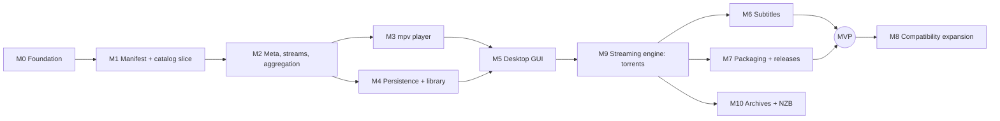

# Roadmap

Milestones are ordered by dependency. Each one ends with something runnable
and tested. Update the **Status** column when a milestone's acceptance
criteria are met, not before.

| Milestone | Status |
|-----------|--------|
| M0 Engineering foundation | **Done** (2026-10-06) |
| M1 Manifest + catalog vertical slice | **Done** (2026-10-06) |
| M2 Meta, streams, aggregation | **Done** (2026-10-06) |
| M3 mpv player | **Done on Linux** (2026-10-06); Windows untested (acceptance: a stream from a mock addon plays and sends progress events) |
| M4 Persistence + library | **Done** (2026-10-06) |
| M5 Desktop GUI | **Implemented** (2026-10-06); acceptance pending: [manual test](dev/GUI_MANUAL_TEST.md) on Linux and Windows |
| M9 Streaming engine: torrents | **Implemented** (2026-10-06); acceptance pending: [torrent manual test](dev/GUI_MANUAL_TEST.md#torrents-m9) on Linux and Windows. Moved ahead of M6/M7 (owner decision 2026-10-06) |
| M6 Subtitles, M7 Packaging | Next after M9 |
| M8, M10 | Planned |

---

Finished milestones (M0–M4) are summarized in the table above; what they
delivered is in [CHANGELOG.md](../CHANGELOG.md) and the git history.

### M5 — Desktop GUI
- **Prerequisites:** M3, M4. UI technology: egui (ADR-0011).
- **Deliverables:**
  - Board, Discover, Detail, Streams.
  - Play in mpv.
  - Library and continue watching.
  - Addon management.
- **Tests:** core-level tests carry the logic; a UI smoke test; manual test
  script in `docs/dev/`.
- **Acceptance:** the GOALS.md success scenario 1 works on Linux and Windows.

### M6 — Subtitles
- **Prerequisites:** M5.
- **Deliverables:**
  - The subtitles resource (with `videoHash`, `videoSize` and `filename`
    extras).
  - Subtitles embedded in stream objects.
  - Track selection and language preference.
  - The fetch policy question resolved (SECURITY.md §Subtitles).
- **Acceptance:** subtitles from a mock subtitle addon display in mpv.

### M7 — Packaging and releases
- **Prerequisites:** M5.
- **Deliverables:**
  - Installers (AppImage or Flatpak, MSI).
  - Bundling or locating libmpv (embedded, ADR-0014) and mpv (fallback).
  - The release workflow producing GUI artifacts.
  - A signing plan.
- **Acceptance:** a tagged pre-release installs and runs on clean machines.

**MVP = M1–M7.**

### M8 — Compatibility expansion (v0.x)
- `addon_catalog`, addon configuration pages, response caching, binge
  groups, deep links (`stremio://` addon install and page links, and
  `cineo://`), `ytId` sources, macOS packaging.
- A compatibility corpus in CI.
- Each item is an independent PR with its own COMPATIBILITY.md row.

### M9 — Local streaming engine: torrents (ADR-0010, ADR-0012)
- **Prerequisites:** M3 player, M5 GUI. Moved ahead of M6/M7 (owner
  decision 2026-10-06).
- **Deliverables:**
  - A library spike: done, `librqbit` 9.0.1 (ADR-0012).
  - The `cineo-stream` crate serving `infoHash`/`fileIdx`/`sources` as a
    loopback HTTP URL with range support.
  - Bounded disk cache.
  - P2P disclosure and a disable setting.
  - Stream status (peers, speed, buffer) in the UI.
- **Tests:**
  - Engine against a local test swarm or fixture torrent with
    public-domain content.
  - Loopback-only binding and path-token tests.
  - Cache limit tests.
- **Acceptance:** a torrent stream from a mock addon plays and seeks in mpv
  on Linux and Windows. Disabling P2P hides and blocks torrent sources.

### M10 — Archive and NZB sources (ADR-0010)
- **Prerequisites:** M9.
- **Deliverables:** archive member streaming (rar, zip, 7z, tar, tgz,
  honoring `fileIdx`/`fileMustInclude`), then `nzbUrl` with user-configured
  Usenet servers. Each source type is its own PR with its own COMPATIBILITY
  row.
- **Acceptance:** per source type, the limitations documented in the SDK's
  `stream.md` (seeking support, multi-volume) are matched and tested.

### Later / research
See [GOALS.md](GOALS.md#future-research-not-committed): embedded playback,
casting, mobile, EPG. Cloud sync is not planned (owner decision 2026-10-06).
