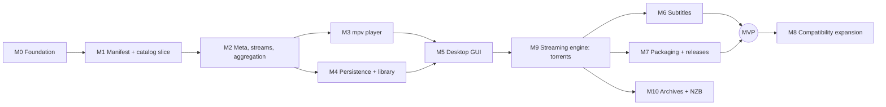

# Roadmap

What Cineo is for, what is in scope, and the milestones that get there.
Status vocabulary across the docs: **VERIFIED** (tested or observed),
**INFERRED** (reasoned, not tested), **UNKNOWN** (not established).

- [Goals](#what-we-are-building)
- [Milestones](#milestones)

## What we are building

**Cineo is an independent, local-first desktop media center written in Rust.**
It discovers content through third-party **addons that speak the publicly
documented Stremio addon protocol** (HTTP transport). With it you can browse
addon catalogs, view details, pick a stream, play it in a real media player
(mpv), and keep a personal library with watch progress.

**Product goal: the same user-facing behavior as Stremio** on the desktop.
That covers addons, browsing, stream sources (including torrents), playback,
library and deep links. The exceptions are cloud sync (not planned for now)
and anything that would require Stremio's private services. Owner decision,
2026-10-06 (ADR-0010).

Cineo is its own product. It has its own name, code and design, and it is not
affiliated with Stremio. "Stremio-like" describes the *functional model*, not
the brand or the code (see [LEGAL.md](LEGAL.md)).

## Who it is for

- Desktop users who want a fast, native media center driven by community addons.
- Self-hosters who run their own addons on their own network.
- Developers who want a well-tested, open Rust implementation of the addon
  client side of the protocol.

## What "Stremio-like" means, functionally

1. **Addons are the content layer.** The app ships no content and no content
   sources. Users install addons by URL.
2. **Aggregation.** Catalogs, metadata, streams and subtitles are requested
   from every installed addon that declares support. The results are merged.
3. **Discover → Detail → Streams → Play.** This is the core user journey.
4. **Library and continue-watching** are built from playback progress.

## What compatibility means

An addon that works with the reference client should work with Cineo for the
**supported protocol surface** listed in
[ADDON_PROTOCOL.md](ADDON_PROTOCOL.md):

- Cineo sends the same requests: same URL shape, same encoding, same filtering.
- Cineo interprets the responses the same way, including the reference
  client's tolerance of malformed data.

Every compatibility claim is tracked in [COMPATIBILITY.md](COMPATIBILITY.md)
with a status. A claim needs a test before it can be "Supported", and testing
against real addons before it can be "Verified".

Compatibility does **not** cover:
- Stremio's private account API (`api.strem.io`).
- Its streaming server.
- Its UI. We match behavior, not look.

Cineo **does** handle `stremio://` deep links (addon install and page links,
as documented in the SDK's `deep-links.md`) as well as its own `cineo://`.

## Scope

### MVP (the first release worth using)

| Capability | Needs |
|-----------|-------|
| Install/remove addons by manifest URL; order them | local persistence |
| Board and Discover: browse catalogs, filters (`genre`), paging (`skip`), search | addons |
| Detail page: meta, and the episode list for series | addons |
| Streams aggregated across addons; direct `http(s)` URL streams playable | addons, player |
| Playback in mpv: play/pause/seek, audio and subtitle track choice | player (mpv) |
| Subtitles from stream objects and subtitle addons | addons, player |
| Library, watch progress, continue watching | local persistence, player events |
| Desktop GUI on Linux and Windows | platform shell |

### v0.x (incremental after the MVP)

- macOS builds; packaging (AppImage/Flatpak, MSI, DMG).
- Binge-watching: next episode, with `bingeGroup` stream matching.
- `addon_catalog` (discovering addons from addons), addon configuration pages.
- Deep links: `stremio://` (addon install and page links) and `cineo://`.
  Every link needs user confirmation before it changes state.
- `ytId` (YouTube) stream sources.
- Response caching that honors `Cache-Control`.
- Per-addon trust for self-hosted (private-network) addons.

- **Local streaming engine (ADR-0010)**: torrent sources (`infoHash`,
  `fileIdx`, `sources`) first, then archive sources (`rarUrls`, `zipUrls`,
  `7zipUrls`, `tgzUrls`, `tarUrls`), then `nzbUrl`.

### v1.0

- Stremio-equivalent behavior for the supported surface, on Linux, Windows
  and macOS, including torrent streams.
- Compatibility verified against a published corpus of real addons.
- Data export and import; schema migrations with tests.
- Signed release artifacts.

### Future research (not committed)

- Casting (Chromecast, DLNA), and Android, iOS, TV and web/WASM targets.
- Live TV EPG (`epgProvider`, scheduled videos). This is needed for full
  parity, so it is scheduled after v1.0.

### Explicitly out of scope

- Hosting, indexing or recommending content sources. Cineo is a client.
- Stremio's private APIs, streaming server, branding or assets.
- The legacy (`/stremio/v1`) and IPFS addon transports, even though the
  reference client still supports legacy (owner decision 2026-10-06).
- Analytics and telemetry.
- **Cloud or account sync, for now** (owner decision 2026-10-06). Cineo is
  local-only. Data export and import cover moving between machines.
  Revisit with a new ADR if this changes.

## Platforms

| Platform | Status |
|----------|--------|
| Linux x86_64 | Initial target (primary development platform) |
| Windows x86_64 | Initial target |
| macOS aarch64 | Best-effort until v1.0; built and tested in CI |
| Android, iOS, TV, Web | Postponed. The core is kept free of IO so it can be reused. |

## What depends on what

| Capability | Addons | Own backend | Fully local | Account sync | Media player | Platform integration |
|-----------|:--:|:--:|:--:|:--:|:--:|:--:|
| Catalogs, meta, streams, subtitles lists | ✔ | | | | | |
| Installed addons, library, progress | | | ✔ | | | |
| Playback, tracks, subtitle rendering | | | ✔ | | ✔ | |
| Deep links, file associations | | | ✔ | | | ✔ |
| Casting | | | | | ✔ | ✔ |
| Torrent / archive / NZB sources | | | ✔ | | ✔ | local streaming engine (ADR-0010) |

## Success looks like

1. A user installs Cinemeta plus a stream addon and goes from Board to playing
   a movie in under a minute, with no crashes on malformed addon data.
2. Every row in [COMPATIBILITY.md](COMPATIBILITY.md) marked Supported has an
   automated test, and every Verified row has a dated manual or live check.
3. A new contributor, human or agent, can make a correct, reviewed change by
   reading `AGENTS.md` and the docs it links. They do not need tribal knowledge.

## Milestones

Milestones are ordered by dependency. Each one ends with something runnable
and tested. Update the **Status** column when a milestone's acceptance
criteria are met, not before.

| Milestone | Status |
|-----------|--------|
| M0 Engineering foundation | **Done** (2026-10-06) |
| M1 Manifest + catalog vertical slice | **Done** (2026-10-06) |
| M2 Meta, streams, aggregation | **Done** (2026-10-06) |
| M3 mpv player | **Done on Linux** (2026-10-06); Windows untested (acceptance: a stream from a mock addon plays and sends progress events) |
| M4 Persistence + library | **Done** (2026-10-06) |
| M5 Desktop GUI | **Implemented** (2026-10-06); acceptance pending: [manual test](DEVELOPMENT.md#manual-gui-test) on Linux and Windows |
| M9 Streaming engine: torrents | **Implemented** (2026-10-06); acceptance pending: [torrent manual test](DEVELOPMENT.md#torrents-m9) on Linux and Windows. Moved ahead of M6/M7 (owner decision 2026-10-06) |
| M6 Subtitles, M7 Packaging | Next after M9 |
| M8, M10 | Planned |

---

Finished milestones (M0–M4) are summarized in the table above; what they
delivered is in [CHANGELOG.md](../CHANGELOG.md) and the git history.

### M5 — Desktop GUI
- **Prerequisites:** M3, M4. UI technology: egui (ADR-0011).
- **Deliverables:**
  - Board, Discover, Detail, Streams.
  - Play in mpv.
  - Library and continue watching.
  - Addon management.
- **Tests:** core-level tests carry the logic; a UI smoke test; manual test
  script in [DEVELOPMENT.md](DEVELOPMENT.md#manual-gui-test).
- **Acceptance:** success scenario 1 (below, under Goals) works on Linux and Windows.

### M6 — Subtitles
- **Prerequisites:** M5.
- **Deliverables:**
  - The subtitles resource (with `videoHash`, `videoSize` and `filename`
    extras).
  - Subtitles embedded in stream objects.
  - Track selection and language preference.
  - The fetch policy question resolved (SECURITY.md §Subtitles).
- **Acceptance:** subtitles from a mock subtitle addon display in mpv.

### M7 — Packaging and releases
- **Prerequisites:** M5.
- **Deliverables:**
  - Installers (AppImage or Flatpak, MSI).
  - Bundling or locating libmpv (ADR-0014).
  - The release workflow producing GUI artifacts.
  - A signing plan.
- **Acceptance:** a tagged pre-release installs and runs on clean machines.

**MVP = M1–M7.**

### M8 — Compatibility expansion (v0.x)
- `addon_catalog`, addon configuration pages, response caching, binge
  groups, deep links (`stremio://` addon install and page links, and
  `cineo://`), `ytId` sources, macOS packaging.
- A compatibility corpus in CI.
- Each item is an independent PR with its own COMPATIBILITY.md row.

### M9 — Local streaming engine: torrents (ADR-0010, ADR-0012)
- **Prerequisites:** M3 player, M5 GUI. Moved ahead of M6/M7 (owner
  decision 2026-10-06).
- **Deliverables:**
  - A library spike: done, `librqbit` 9.0.1 (ADR-0012).
  - The `cineo-stream` crate serving `infoHash`/`fileIdx`/`sources` as a
    loopback HTTP URL with range support.
  - Bounded disk cache.
  - P2P disclosure and a disable setting.
  - Stream status (peers, speed, buffer) in the UI. Shown as a bottom bar
    until 2026-10-07; the player now shows a spinner instead.
- **Tests:**
  - Engine against a local test swarm or fixture torrent with
    public-domain content.
  - Loopback-only binding and path-token tests.
  - Cache limit tests.
- **Acceptance:** a torrent stream from a mock addon plays and seeks in mpv
  on Linux and Windows. Disabling P2P hides and blocks torrent sources.

### M10 — Archive and NZB sources (ADR-0010)
- **Prerequisites:** M9.
- **Deliverables:** archive member streaming (rar, zip, 7z, tar, tgz,
  honoring `fileIdx`/`fileMustInclude`), then `nzbUrl` with user-configured
  Usenet servers. Each source type is its own PR with its own COMPATIBILITY
  row.
- **Acceptance:** per source type, the limitations documented in the SDK's
  `stream.md` (seeking support, multi-volume) are matched and tested.

### Later / research
See [Future research](#future-research-not-committed): casting, mobile, EPG.
Cloud sync is not planned (owner decision 2026-10-06).
